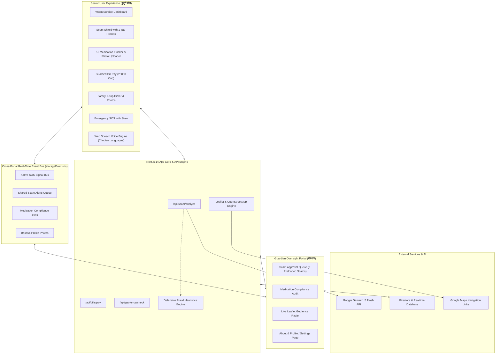
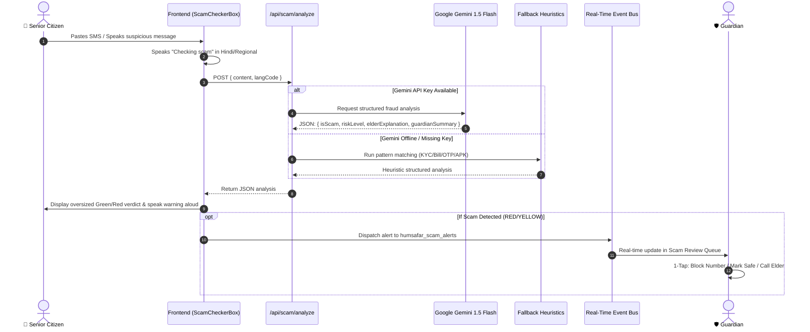
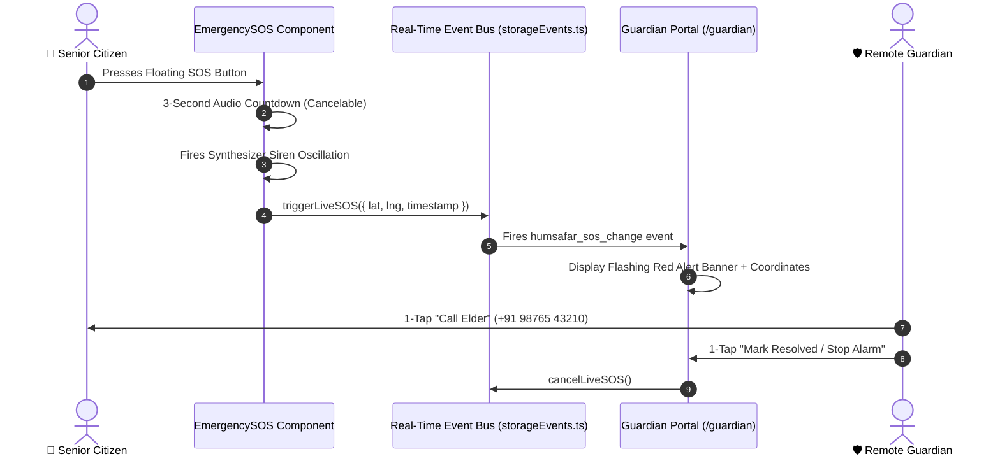

# 👵👴 HUMSAFAR (हमसफ़र)
### Senior Citizen Care Companion & AI Scam Shield
**Prompt War Project** | *A culturally tuned, elder-first assistive platform empowering Indian seniors and safeguarding them against digital threats.*

[](https://nextjs.org/)
[](https://www.typescriptlang.org/)
[](https://tailwindcss.com/)
[](https://leafletjs.com/)
[](https://ai.google.dev/)
[](https://firebase.google.com/)
[](https://vitest.dev/)

---

## 📖 Executive Summary

**HUMSAFAR (हमसफ़र)** is a comprehensive dual-mode web platform created to bridge the digital divide for elderly citizens (grandparents) in India while providing peace of mind to their remote adult caregivers (guardians).

Modern digital interfaces often overwhelm seniors with small typography, low contrast, complex navigation, and hidden traps. More critically, Indian seniors are disproportionately targeted by aggressive digital extortion schemes—such as fake electricity disconnection threats, spurious KYC expiration notices, OTP interception, pension fraud, and predatory loan APK downloads.

**HUMSAFAR solves this with two synchronized experiences:**
1. **Senior Mode (बुजुर्ग मोड):** An ultra-accessible interface featuring warm sunrise tones, glassmorphism, oversized touch targets (64px+), hyper-contrast colors, zero jargon, voice-first interactions across 7 Indian regional languages, and intelligent safeguards.
2. **Guardian Portal (संरक्षक नियंत्रण कक्ष):** A centralized oversight command center for adult family members to monitor medication compliance, inspect flagged scam messages, manage open-source Leaflet geofence perimeters, and receive real-time emergency SOS alerts.

---

## 🌅 Visual Theme, Palette & Glassmorphism

* **Warm Sunrise Color Palette:**
  * Radiant Sunrise Yellows (`#FDE047`, `#FACC15`)
  * Rich Warm Oranges (`#FB923C`, `#F97316`)
  * Soft Sunset Pinks & Reds (`#F87171`, `#EF4444`)
  * Deep High-Contrast Slate Text (`#0F172A`) preserving WCAG AAA readability.
* **Glassmorphism:**
  * Ultra-smooth semi-transparent glass cards (`backdrop-blur-md bg-white/75 border border-white/80 shadow-2xl rounded-3xl`).
* **Elder-Friendly Floating SVG Stickers:**
  * Subtle, low-opacity floating background accents: *Chai tea cup, spectacles, walking cane, heart-in-hands, and sacred lotus flower* softly animated in screen corners.

---

## 🌟 Key Features & Functional Modules

### 1. 🚪 Dual Landing Portal with Local Photo Upload
* **Senior & Guardian Cards:** Choose between **Senior Mode (दादा/दादी मोड)** and **Guardian Portal (केयरगिवर मोड)**.
* **Direct File System Photo Uploader:** Both cards feature `<input type="file" accept="image/*" />` to upload personal profile pictures directly from computer or smartphone storage.
* **Persistent Storage:** Stored as Base64 in LocalStorage so avatars persist throughout the session and appear across headers and profiles.

### 2. 🛡️ AI Scam Shield (धोखाधड़ी जांच) & Real-time Escalation
* **Google Gemini 1.5 Flash Analysis:** Analyzes forwarded WhatsApp messages, SMS texts, and suspicious calls.
* **Instant Dual-Output Classification:**
  * **For Seniors:** Reassuring, single-sentence guidance in native language (e.g. *"सावधान दादाजी! यह एक झूठा और ठगी भरा संदेश है। किसी को पैसे या ओटीपी बिल्कुल न दें!"*).
  * **For Guardians:** Technical analysis breaking down vector patterns (electricity extortion, phishing links, remote-access APKs).
* **Zero-Downtime Defensive Heuristics:** Built-in rule engine detects Indian fraud patterns even if the Gemini API key is unset or offline.
* **Real-time Event Bus:** Flagged suspicious messages are automatically transmitted to the Guardian Review Queue.

### 3. 🗺️ Open-Source Map Engine (Leaflet & OpenStreetMap)
* **Interactive Live Radar:** Powered by client-side dynamic **Leaflet** and **OpenStreetMap**.
* **Safe Zone Perimeter:** Configurable green safe-zone circular perimeter (e.g., 2km radius) with a slider to adjust between 500m and 5km.
* **Live Haversine Calculation:** Continuously calculates distance between senior GPS coordinates and home base.
* **Breach Simulation Controls:** 1-tap demo buttons to simulate senior at home vs. leaving the safe zone (breach alert).
* **Direct Navigation:** 1-tap button to open live coordinates directly in Google Maps.

### 4. 💊 Visual Pill & Medication Tracker (दवाइयां)
* **Realistic Imagery:** Dynamic SVG visualizer for tablets, capsules, and eye drops, with an option to upload real photos of pill packaging.
* **5+ Realistic Senior Prescriptions Pre-loaded:**
  1. *Telmisartan 40mg* — Blood Pressure (Morning, 08:00 AM)
  2. *Metformin 500mg* — Diabetes Capsule (Afternoon, 01:00 PM)
  3. *Lubricant Eye Drops* — Moisturizing Drops (Afternoon, 03:30 PM)
  4. *Calcium & Vitamin D3* — Joint Pain & Bone Health (Evening, 06:30 PM)
  5. *Ecosprin 75mg* — Blood Thinner / Heart Health (Night, 09:00 PM)
* **Time-Slot Filtering:** Quick filter pills (All, Morning, Afternoon, Evening, Night).
* **Add Medicine Drawer:** Add custom prescriptions with dosage, photo, and instructions.
* **Daily Compliance Audit:** Real-time progress bar synced with Guardian compliance table.

### 5. 📞 1-Tap Family Contacts with Gallery Photo Uploads
* **Real Photo Uploads:** Upload family member pictures directly from computer or phone gallery.
* **Circular Avatar Crop & Initials Fallback:** Displays crisp circular avatars or monogram initials.
* **Editable Modal:** Update name, relationship (Son, Daughter, Grandson, Doctor), phone number, and live availability.
* **Calling Simulation:** 1-tap voice call and video call buttons with audio synthesis readouts.

### 6. 💳 Guarded Bill Payments (सुरक्षित बिल भुगतान)
* **Duplicate Bill Detection:** Flags bills that have already been paid to prevent accidental repeat payments.
* **₹3,000 Safety Cap:** Automatically blocks high-value payments and redirects them to the Guardian for remote OTP verification.
* **Voice Feedback:** Confirms successful payments aloud in the senior's selected language.

### 7. 🚨 Live SOS System & Working Guardian "About" Section
* **Live SOS Linkage:** When the floating SOS button is pressed on Senior Mode, an urgent flashing red banner and siren chime trigger instantly on the Guardian Portal with GPS coordinates.
* **Guardian About & Profile Page (`/guardian/about`):**
  * Active device pairing status (*Dada-ji's Samsung Galaxy A14, 88% battery*).
  * Caregiver contact information.
  * WhatsApp & SMS notification gateway toggles with persistence.
  * Senior spend cap threshold & geofence radius settings.
  * App version and security audit specifications.

---

## 🏛️ System Architecture & Workflows

### High-Level Architecture



---

### Workflow 1: AI Scam Shield Analysis Flow



---

### Workflow 2: Emergency SOS Live Linkage Flow



---

## 🎨 Elder-First UX & Design Philosophy

HUMSAFAR implements accessibility rules designed specifically for older adults with diminishing eyesight, cognitive fatigue, and motor tremor:

| Design Dimension | Standard Web Apps | HUMSAFAR Elder Standard |
| :--- | :--- | :--- |
| **Touch Target Size** | 32px – 44px | **64px – 96px minimum** |
| **Typography Scale** | 14px – 16px body | **20px (`elder-base`) to 48px (`elder-3xl`)** |
| **Contrast Ratio** | Low/Subtle (~3:1) | **Ultra High Contrast (WCAG AAA compliant)** |
| **Theme & Palette** | Generic flat colors | **Warm Sunrise Gradients & Glassmorphic Surfaces** |
| **Input Modality** | Typing on keyboard | **One-touch voice microphone + spoken feedback** |
| **Language Support** | English only | **Hindi, Tamil, Telugu, Bengali, Marathi, Gujarati, English** |
| **Cognitive Load** | Deep nested menus | **Flat cards, maximum 4 options per screen** |

---

## 🗺️ Application Navigation Map

| Route | Role | Description |
| :--- | :--- | :--- |
| `/` | **Landing** | Dual role selection portal with profile photo uploaders for Senior & Guardian. |
| `/senior` | **Senior** | Central dashboard with 4 oversized modules: Medicines, Bills, Family, Scam Shield. |
| `/senior/scam-shield` | **Senior** | Paste, speak, or select sample scams with instant AI analysis & audio readouts. |
| `/senior/medications` | **Senior** | Daily medicine schedule with 5+ presets, packaging photo uploads, and add drawer. |
| `/senior/bills` | **Senior** | View electricity, water, and phone bills with duplicate protection and ₹3,000 cap. |
| `/senior/family` | **Senior** | Photo avatars of family members with gallery uploads, live availability, and speed-dial. |
| `/guardian` | **Guardian** | Command center with Leaflet OSM radar, Scam Review Queue, and Medication Audit. |
| `/guardian/about` | **Guardian** | Dedicated profile, device pairing status, WhatsApp/SMS toggles, and system specs. |
| `/api/scam/analyze` | **Backend API** | POST endpoint running Gemini 1.5 Flash + Heuristics for fraud detection. |
| `/api/bills/pay` | **Backend API** | POST endpoint validating duplicate status, spending limits, and guardian approvals. |
| `/api/geofence/check` | **Backend API** | POST endpoint evaluating Haversine distance from the elder's home coordinates. |

---

## 🧪 Interactive Demo Scenarios & Test Presets

Try testing these pre-configured scenarios in the application:

1. **⚡ Electricity Cutoff Scam (Preloaded in Guardian Queue & Senior Chips):**
   > *"प्रिय उपभोक्ता, आपके बिजली बिल का भुगतान न होने के कारण आज रात 9:30 बजे बिजली काट दी जाएगी। तुरंत 9876543210 पर संपर्क करें।"*
   * **Result:** Flagged as **CRITICAL DANGER**; warns senior not to call or transfer money; sent to Guardian queue.

2. **🏦 Bank KYC Account Freeze:**
   > *"SBI Alert: Your YONO bank account has been blocked due to pending PAN card verification. Click http://bit.ly/sbi-pan-kyc to reactivate immediately."*
   * **Result:** Flagged as **CRITICAL DANGER**; escalates to Guardian approval queue.

3. **🎁 Lottery / Pension Bonus Scam:**
   > *"बधाई हो! आपका नाम PM पेंशन योजना लॉटरी में ₹2,50,000 के लिए चुना गया है। ₹1,499 शुल्क भेजकर तुरंत राशि प्राप्त करें।"*
   * **Result:** Flagged as **CRITICAL DANGER**; warns that government schemes never ask for upfront UPI fees.

4. **📍 Live Geofence Breach Demo:**
   * Open [http://localhost:3000/guardian](http://localhost:3000/guardian).
   * In the Live Geofencing section, click **"🚨 बाहर भेजें (Simulate Breach)"**.
   * Observe the map pan outside the green perimeter and the flashing alert banner appear!

---

## 💻 Tech Stack & Dependencies

* **Framework:** [Next.js 14](https://nextjs.org/) (App Router, Server Components & Route Handlers)
* **Language:** [TypeScript 5](https://www.typescriptlang.org/) (Strict typing across domain models)
* **Styling:** [Tailwind CSS 3.4](https://tailwindcss.com/) (Custom elder tokens, sunrise gradients, glassmorphism)
* **Maps:** [Leaflet 1.9](https://leafletjs.com/) + [OpenStreetMap](https://www.openstreetmap.org/)
* **Icons:** [Lucide React](https://lucide.dev/) (High-visibility vector icons)
* **AI Engine:** [Google Gemini 1.5 Flash](https://ai.google.dev/) via `@google/genai`
* **Voice Engine:** Native Web Speech API (`SpeechSynthesis` & `webkitSpeechRecognition`)
* **Audio Synthesizer:** Web Audio API (`AudioContext` sawtooth oscillator for emergency siren)
* **Persistence:** LocalStorage Base64 & IndexedDB cross-tab event bus
* **Testing:** [Vitest 1.6](https://vitest.dev/) with `jsdom` (10 automated unit tests)

---

## 🚀 Running Locally

```bash
# 1. Clone repository
git clone https://github.com/Adete7/PromptWarProject.git
cd PromptWarProject

# 2. Run from workspace root (proxies into humsafar)
npm run dev

# 3. Or run directly from humsafar
cd humsafar
npm run dev

# 4. Run automated test suite
npm run test
```

Open [http://localhost:3000](http://localhost:3000) in your browser.

---

## 👥 Contributors & Acknowledgments
Built with ❤️ for Indian seniors and families as part of the **Prompt War Project**.
* **Repository:** [https://github.com/Adete7/PromptWarProject](https://github.com/Adete7/PromptWarProject)
